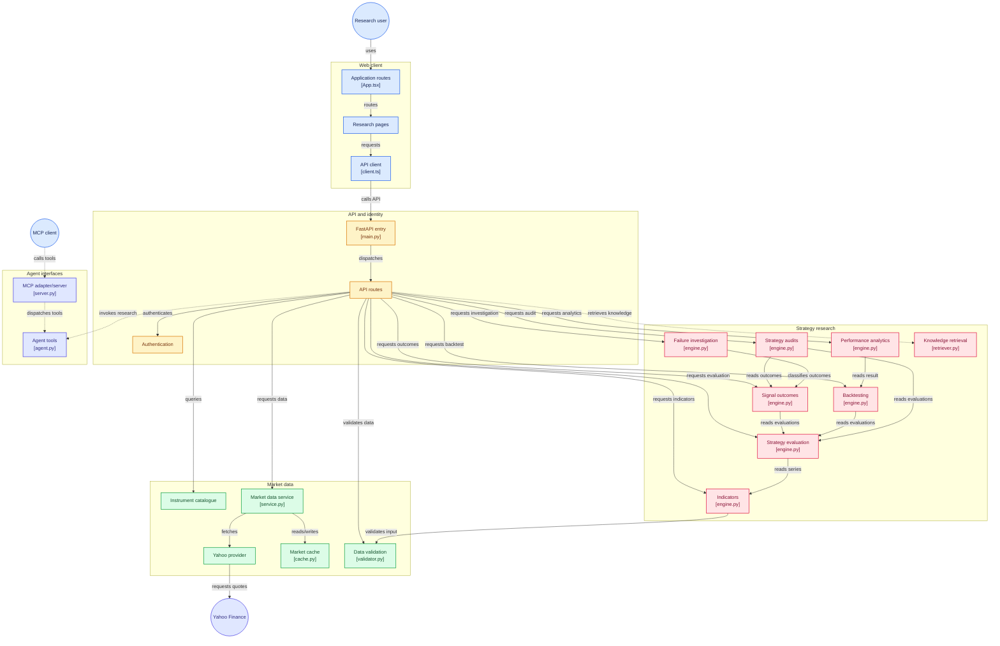

# 📈 TradeLens AI — Evidence-Driven Quantitative Strategy Research Platform

**TradeLens AI** is a full-stack quantitative research platform for transforming historical market data into **validated signals, reproducible backtests, performance analytics, strategy audits, and explainable research outcomes**.

Rather than treating a backtest as the final answer, TradeLens AI is designed around the complete strategy-research lifecycle:

```text
Market Data
    ↓
Validation
    ↓
Indicators
    ↓
Strategy Rules
    ↓
Signal Outcomes
    ↓
Backtesting
    ↓
Performance Analytics
    ↓
Strategy Audit
    ↓
Failure Investigation
    ↓
Research Insight
```

The platform combines a **React research interface, FastAPI backend, deterministic quantitative engines, market-data validation, knowledge retrieval, and agent/MCP interfaces** within one modular research architecture.

> **The objective is not simply to discover profitable-looking strategies — it is to understand how, when, and why a strategy behaves the way it does.**

---

# 🎯 Why TradeLens AI?

A strategy can produce an attractive historical return and still be unreliable.

Common research problems include:

- Poor-quality OHLCV data
- Missing or duplicate observations
- Indicator calculation errors
- Look-ahead bias
- Weak signal definitions
- Insufficient historical data
- Overfitting
- Regime dependency
- Unrealistic backtest assumptions
- Misleading aggregate metrics
- Strategies that fail under slightly different conditions

TradeLens AI approaches strategy research as a **pipeline of evidence** rather than a single performance number.

```text
"Did this strategy make money?"
              ↓
     is only one question.

TradeLens AI also asks:

"Was the input data valid?"
"Why was the signal generated?"
"What happened after the signal?"
"How did the strategy perform?"
"Where did it fail?"
"What evidence supports the conclusion?"
```

---

# ✨ Core Capabilities

## 📊 Market Data Pipeline

TradeLens AI separates market-data acquisition from the research engines.

```text
Instrument
    ↓
Market Data Service
    ↓
Cache Check
   ↙      ↘
Hit       Miss
 ↓          ↓
Data      Provider
            ↓
       Yahoo Finance
            ↓
          Cache
            ↓
        Validation
```

This keeps external provider behaviour isolated from indicator, strategy, and backtesting logic.

---

## 🗂️ Instrument Catalogue

The instrument layer provides a structured catalogue of securities available to the research platform.

Instead of coupling strategy logic directly to provider-specific symbols, instrument discovery is handled independently.

```text
Research Request
      ↓
Instrument Catalogue
      ↓
Resolved Instrument
      ↓
Market Data Service
```

This provides a cleaner boundary between the research domain and external data-provider conventions.

---

# 🛡️ Market Data Validation

Quantitative research is only meaningful when its input data is trustworthy.

TradeLens AI therefore includes a dedicated validation layer before market data reaches the research engines.

Validation is designed to catch problems such as:

- Invalid OHLCV values
- Non-finite numeric values
- Invalid timestamps
- Duplicate observations
- Non-monotonic dates
- Missing values
- Invalid OHLC relationships

Conceptually:

```text
Raw OHLCV
    ↓
Validation Engine
    ↓
┌───────────────────┐
│ Finite values     │
│ Valid timestamps  │
│ OHLC consistency  │
│ Duplicate checks  │
│ Ordering checks   │
│ Missing-data check│
└───────────────────┘
    ↓
Validated Series
```

Invalid market data should fail before it can silently contaminate indicators or backtest results.

---

# 📐 Technical Indicator Engine

The indicator engine transforms validated market data into reusable quantitative features.

The architecture keeps indicator calculation independent from individual strategies:

```text
Validated OHLCV
      ↓
Indicator Engine
      ↓
Technical Series
      ↓
Strategy Engine
```

This separation means the same indicator calculations can support multiple research workflows without duplicating logic inside each strategy.

The platform architecture is designed for indicators such as:

- Moving averages
- RSI
- Volume statistics
- Relative volume
- Additional technical features as the research library expands

---

# 🧠 Strategy Evaluation Engine

Strategies are evaluated as deterministic rules over market data and derived indicators.

```text
Market Series
      +
Indicators
      +
Strategy Rules
      ↓
Strategy Engine
      ↓
Evaluation
```

The strategy layer is intentionally separated from performance reporting.

Its responsibility is to determine whether the conditions defined by a strategy are satisfied — not to make unsupported predictions about future market behaviour.

This makes strategy behaviour easier to test, inspect, and reproduce.

---

# 🎯 Signal Outcome Analysis

A signal is not useful merely because it occurred.

TradeLens AI includes a dedicated outcome layer for studying what happened **after** strategy conditions were satisfied.

```text
Strategy Signal
      ↓
Forward Market Behaviour
      ↓
Outcome Engine
      ↓
Outcome Classification
```

This creates an important separation between:

```text
Signal Generation
        ≠
Signal Outcome
        ≠
Portfolio Performance
```

That distinction makes it possible to investigate strategy behaviour more deeply than a conventional equity curve alone.

---

# 🧪 Backtesting Engine

The backtesting layer evaluates strategy behaviour over historical market data.

```text
Validated Market Data
        ↓
Indicator Engine
        ↓
Strategy Evaluations
        ↓
Backtesting Engine
        ↓
Historical Result
```

Keeping the backtesting engine downstream from deterministic strategy evaluation makes the research process easier to reason about.

Backtesting answers:

> **What would this strategy have done historically under the implemented assumptions?**

It does **not** establish that the same performance will occur in the future.

---

# 📈 Performance Analytics

Raw backtest returns are not enough to evaluate a strategy.

TradeLens AI therefore separates backtest execution from performance analytics.

```text
Backtest Result
      ↓
Analytics Engine
      ↓
Performance Profile
```

The analytics layer can be used to evaluate characteristics such as:

- Returns
- Drawdowns
- Trade behaviour
- Win/loss characteristics
- Risk-adjusted performance
- Strategy consistency
- Comparative performance

This encourages evaluation of a strategy as a distribution of outcomes rather than a single headline return.

---

# 🔍 Strategy Auditing

One of TradeLens AI's defining architectural features is the **strategy-audit layer**.

Instead of ending research after a backtest, the platform can inspect the relationship between:

```text
Strategy Conditions
       +
Signal Evaluations
       +
Observed Outcomes
       ↓
Strategy Audit
```

The audit layer is intended to help answer questions such as:

- Were strategy rules evaluated consistently?
- Which conditions generated the signal?
- How frequently were conditions satisfied?
- What happened after those signals?
- Are particular conditions associated with weak outcomes?
- Is there enough evidence to support the observed behaviour?

This turns strategy testing into a more traceable research process.

---

# 🔬 Failure Investigation

Profitable trades explain only part of a strategy.

Understanding **why a strategy fails** can be equally important.

TradeLens AI includes a dedicated investigation engine downstream of signal outcomes.

```text
Strategy Outcomes
      ↓
Outcome Classification
      ↓
Failure Investigation
      ↓
Research Evidence
```

This enables research to move from:

```text
"The strategy lost here."
```

toward:

```text
"What conditions were present when it failed?"
```

The objective is not to automatically optimize every failure away, but to make failure patterns visible and researchable.

---

# 📚 Knowledge Retrieval

TradeLens AI includes a knowledge-retrieval layer that can provide supporting research context to higher-level workflows.

```text
Research Question
      ↓
Knowledge Retriever
      ↓
Relevant Context
      ↓
Research / Agent Layer
```

The architecture keeps retrieved knowledge separate from deterministic calculations such as indicators, signals, and backtests.

This is important because external or retrieved knowledge should **inform research**, not silently modify numerical results.

---

# 🤖 Agent Research Interface

TradeLens AI exposes research functionality through an agent-oriented interface.

Rather than giving an AI agent unrestricted responsibility for quantitative calculations, the agent can invoke defined research capabilities.

```text
Research Request
      ↓
Agent
      ↓
Research Tools
 ┌────┼───────────────┐
 ↓    ↓               ↓
Data Indicators   Backtesting
 ↓    ↓               ↓
Outcomes          Analytics
      ↓
Audit / Investigation
```

The quantitative engines remain deterministic components underneath the agent interface.

This creates a useful separation:

> **AI can orchestrate and explain research while the quantitative engines remain responsible for the calculations.**

---

# 🔌 MCP Integration

TradeLens AI includes a **Model Context Protocol (MCP)** adapter/server for exposing research capabilities to compatible clients.

```text
MCP Client
     ↓
MCP Server
     ↓
Agent Tools
     ↓
TradeLens Research Engines
```

This allows the platform's research capabilities to be accessed beyond the primary web interface without duplicating the underlying strategy logic.

The MCP layer acts as an interface to the research system rather than becoming a second implementation of it.

---

# 🏗️ System Architecture

TradeLens AI is organized into five major layers:

**Web Client → API & Identity → Market Data → Strategy Research → Agent Interfaces**



> The architecture diagram is interactive on GitHub. Core components link directly to their corresponding implementation files.

---

# 🧩 Architecture Breakdown

## 1. Web Client

The React frontend provides the research-facing experience.

```text
Research User
      ↓
Application Routes
      ↓
Research Pages
      ↓
API Client
```

The frontend is responsible for interaction and visualization while quantitative calculations remain in the backend.

---

## 2. API & Identity

FastAPI provides the main application boundary.

```text
Browser
   ↓
FastAPI
   ↓
Authentication
   ↓
API Routes
   ↓
Research Services
```

The API layer coordinates requests without embedding indicator or strategy calculations directly inside route handlers.

---

## 3. Market Data

The market-data subsystem manages:

- Instrument discovery
- Data retrieval
- Provider abstraction
- Caching
- Validation

```text
Instrument
    ↓
Market Service
   ↙        ↘
Cache      Provider
             ↓
       Yahoo Finance
             ↓
         Validation
```

The research engines consume validated series rather than interacting directly with external providers.

---

## 4. Strategy Research

The core research pipeline contains dedicated engines for:

```text
Indicators
    ↓
Strategy Evaluation
    ↓
Signal Outcomes
    ↓
Backtesting
    ↓
Analytics
    ↓
Audit
    ↓
Investigation
```

Each stage has a separate responsibility, making research behaviour easier to test and reason about.

---

## 5. Agent Interfaces

Agent and MCP interfaces sit **above** the research engines.

```text
MCP Client
      ↓
MCP Adapter
      ↓
Agent Tools
      ↓
Deterministic Research Engines
```

This architecture allows intelligent interfaces to orchestrate research without moving numerical calculations into the agent itself.

---

# 🔄 End-to-End Research Flow

A typical TradeLens AI research workflow follows:

```text
Research User
      ↓
Select Instrument
      ↓
Market Data Request
      ↓
Cache / Provider
      ↓
Data Validation
      ↓
Indicator Calculation
      ↓
Strategy Evaluation
      ↓
Signal Generation
      ↓
Outcome Analysis
      ↓
Backtesting
      ↓
Performance Analytics
      ↓
Strategy Audit
      ↓
Failure Investigation
      ↓
Research Conclusion
```

This creates a traceable chain from raw market data to the final research interpretation.

---

# 🔬 Research Philosophy

TradeLens AI separates several concepts that are often incorrectly treated as equivalent.

```text
Indicator
   ≠
Signal

Signal
   ≠
Outcome

Outcome
   ≠
Trade

Trade
   ≠
Strategy Quality

Historical Performance
   ≠
Future Performance
```

A strategy should therefore be evaluated across multiple layers of evidence rather than judged solely by its cumulative return.

---

# 🧪 Reproducible Research

The platform architecture is designed around deterministic research components.

Given the same:

```text
Market Data
+
Parameters
+
Indicator Definitions
+
Strategy Rules
+
Backtest Assumptions
```

the quantitative engines should produce the same result.

This makes strategy behaviour easier to:

- Test
- Debug
- Audit
- Compare
- Reproduce
- Explain

Agentic functionality is intentionally layered above this deterministic core.

---

# 🧰 Technology Stack

| Layer | Technology |
|---|---|
| Web Client | React |
| Frontend Language | TypeScript |
| Backend API | FastAPI |
| Research Engine | Python |
| Market Data | Yahoo Finance / yfinance provider |
| Data Processing | Python quantitative stack |
| Authentication | Backend authentication layer |
| API Communication | REST |
| Research Interface | Agent tools |
| External Agent Integration | Model Context Protocol (MCP) |
| Version Control | Git + GitHub |

---

# 📂 Repository Structure

```text
TradeLens-AI/
│
├── frontend/
│   └── src/
│       ├── App.tsx
│       ├── api/
│       │   └── client.ts
│       └── pages/
│
├── backend/
│   └── app/
│       ├── main.py
│       │
│       ├── api/
│       │   └── routes/
│       │
│       ├── auth/
│       ├── instruments/
│       │
│       ├── market_data/
│       │   ├── service.py
│       │   ├── cache.py
│       │   ├── providers/
│       │   │   └── yfinance_provider.py
│       │   └── validation/
│       │       └── validator.py
│       │
│       ├── indicators/
│       │   └── engine.py
│       │
│       ├── strategies/
│       │   └── engine.py
│       │
│       ├── outcomes/
│       │   └── engine.py
│       │
│       ├── backtesting/
│       │   └── engine.py
│       │
│       ├── analytics/
│       │   └── engine.py
│       │
│       ├── audit/
│       │   └── engine.py
│       │
│       ├── investigation/
│       │   └── engine.py
│       │
│       ├── knowledge/
│       │   └── retriever.py
│       │
│       ├── agent/
│       │   └── agent.py
│       │
│       └── mcp/
│           └── server.py
│
└── LICENSE
```

---

# 🤖 AI & Quantitative Research

TradeLens AI follows an important architectural principle:

> **Use deterministic code for quantitative truth and intelligent interfaces for research orchestration and explanation.**

The agent layer should not invent:

- OHLCV data
- Indicator values
- Strategy signals
- Backtest results
- Performance statistics

Instead:

```text
Agent
  ↓
Calls Research Tool
  ↓
Deterministic Engine
  ↓
Structured Result
  ↓
Agent Interpretation
```

This makes agent-assisted quantitative research more traceable and reduces the risk of substituting generated text for actual calculations.

---

# 🛡️ Research Guardrails

TradeLens AI is designed around several research principles.

### Validate Before Calculating

Invalid data should be rejected before indicators or strategies consume it.

### Calculate Before Explaining

Numerical results should come from deterministic engines rather than generated explanations.

### Separate Signals from Outcomes

A technically valid signal does not automatically imply a profitable result.

### Backtest Before Concluding

Strategy behaviour should be evaluated historically before broader claims are considered.

### Audit the Strategy

A strategy's conditions and outcomes should remain inspectable.

### Investigate Failure

Losing or unsuccessful signals are research evidence, not data to hide.

### Keep AI Above the Quantitative Core

Agent interfaces can coordinate research while deterministic code remains responsible for financial calculations.

---

# ⚠️ Research Limitations

Historical quantitative research has unavoidable limitations.

Results can be affected by:

- Data quality
- Survivorship bias
- Look-ahead bias
- Parameter overfitting
- Transaction costs
- Slippage
- Liquidity assumptions
- Corporate actions
- Market-regime changes
- Execution assumptions
- Sample size
- Provider availability

A historically successful strategy therefore does not imply future profitability.

TradeLens AI should be used as a **research and educational platform**, not as a guarantee of trading performance.

---

# 🚀 Future Scope

The architecture can be extended toward:

- Additional technical indicators
- Multiple strategy families
- Parameter sweeps
- Walk-forward analysis
- Cross-validation for time series
- Benchmark comparison
- Transaction-cost modelling
- Slippage modelling
- Portfolio-level backtesting
- Position sizing
- Risk management research
- Multi-timeframe strategies
- Additional market-data providers
- Broader NSE universe coverage
- Futures and options research
- Fundamental-data integration
- Strategy ranking
- Research notebooks
- Experiment tracking
- Expanded MCP research tools
- Agent-assisted strategy investigation

The objective is to expand the research surface while preserving the deterministic and auditable quantitative core.

---

# 🌟 What TradeLens AI Demonstrates

From a software-engineering and quantitative-research perspective, TradeLens AI brings together:

```text
Validated Market Data
          +
Technical Indicators
          +
Deterministic Strategies
          +
Signal Outcomes
          +
Backtesting
          +
Performance Analytics
          +
Strategy Auditing
          +
Failure Investigation
          +
Knowledge Retrieval
          +
Agent / MCP Interfaces
          ↓
Evidence-Driven Strategy Research
```

The project demonstrates:

- Full-stack application architecture
- Quantitative financial research
- Market-data abstraction
- Data validation
- Technical-indicator engineering
- Deterministic strategy evaluation
- Historical backtesting
- Performance analytics
- Outcome classification
- Strategy auditing
- Failure investigation
- Modular FastAPI design
- React research interfaces
- Agent-tool architecture
- Model Context Protocol integration
- Separation of deterministic computation from AI orchestration

---

# 📈 Project Status

**Active development**

TradeLens AI is being developed incrementally, with individual research capabilities validated before expanding the platform further.

The architecture emphasizes:

- Correctness before feature breadth
- Explicit validation
- Deterministic calculations
- Modular research engines
- Testable strategy rules
- Reproducible results
- Traceable research evidence
- Clear boundaries between quantitative logic and agent interfaces

---

# 👤 Project

TradeLens AI is an independent quantitative-research project developed and maintained by **Akshieta Aravind**.

**GitHub:** `@Simplyaksh18`

The project reflects an ongoing exploration of **quantitative finance, full-stack engineering, financial-data systems, backtesting architecture, and agent-assisted research tooling**.

---

# 📄 License

TradeLens AI is distributed under the **MIT License**.

See the `LICENSE` file for details.

---

# 📈 TradeLens AI

### From market data to evidence — not just signals.

**Validation · Indicators · Strategies · Outcomes · Backtesting · Analytics · Auditing · Investigation · MCP**
